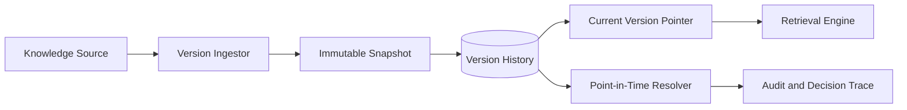

# Volume 14 - Knowledge Versioning

| Field | Value |
|---|---|
| Document ID | WORLD-VOL14-020 |
| Title | Knowledge Versioning |
| Version | 1.0 |
| Status | Approved |
| Classification | Internal |
| Founder | Mahesh Choudhary |

## Purpose

This chapter specifies how Project WORLD tracks the evolution of knowledge over time. Knowledge is not static: policies are amended, SOPs are revised, documents are superseded, and business rules change. Without disciplined versioning, the AI would answer from stale or ambiguous truth, and no decision could be audited against the knowledge that actually governed it. This chapter defines the versioning model that gives every knowledge unit an immutable history, a current authoritative version, and the ability to reconstruct exactly what the enterprise knew at any point in time.

## Scope

This chapter covers version identity, immutable revision history, current-version resolution, point-in-time retrieval, and supersession semantics for all knowledge units in the Knowledge Engine. It applies to documents, policies, SOPs, business rules, and research indexed from the sources of Section B. It aligns with the data quality and governance foundations of Volume 09 (Chapters 27-29) and underpins the validation, governance, and quality controls of the remaining chapters in this section. It does not redefine source-system versioning; it indexes and reconciles source versions into a unified knowledge history.

## Architecture

Every knowledge unit carries a stable identity and an ordered chain of immutable versions. Each version records its content snapshot, author, effective date, source revision, and change reason. A current-version pointer resolves the authoritative revision, while all prior versions remain retrievable for audit and point-in-time reconstruction. Supersession links connect a retired version to the one that replaces it, preserving lineage rather than deleting history.

This architecture guarantees that the current answer is always the authoritative one, while any historical answer can be faithfully reconstructed.

## Data Flow

When a source unit changes, the version ingestor captures an immutable snapshot, assigns the next version number, records the change reason, and advances the current-version pointer. Retrieval resolves the current version by default; audit and point-in-time queries resolve the version effective on a specified date. Supersession events retire the prior version without erasing it.

| Version Element | Description | Retrieval Use |
|---|---|---|
| Version ID | Ordered revision identifier | Selects a specific revision |
| Effective date | When the version became authoritative | Point-in-time resolution |
| Change reason | Why the revision was made | Audit and review context |
| Source revision | Originating system version | Reconciliation and lineage |
| Supersession link | Pointer to replacing version | Traces evolution of knowledge |

## Relationship with AI

The AI Partner always retrieves the current authoritative version so its answers reflect present truth. When explaining a past decision, it resolves the version that was effective on the decision date, ensuring the explanation matches the knowledge that actually applied. Versioning prevents the AI from blending stale and current content, and every cited answer carries its version so users can verify currency.

## Relationship with ERP

The ERP is the system of record for transactions; the Knowledge Engine is the system of record for the knowledge that governed them. Versioning binds the two: when the ERP records a decision, the knowledge version effective at that moment is captured alongside it, so the decision can later be explained against the exact policy or rule revision in force. Source systems such as the Business Rules Engine (Volume 05) remain authoritative producers of their own revisions, which versioning reconciles into a unified history.

## Relationship with Analytics

Analytics (Volume 04) consumes version metadata to correlate outcomes with knowledge changes. Because each unit is versioned with an effective date, analytics can attribute a shift in behaviour to a specific revision, measure adoption of a new policy, and feed the freshness and accuracy dimensions of knowledge quality in Chapter 25.

## Implementation Strategy

WORLD implements versioning as an append-only history keyed by stable knowledge identity. Snapshots are immutable, the current pointer is atomically advanced, and no version is ever destructively overwritten. High-change, high-impact units - compliance policies, credit rules, safety SOPs - are onboarded first. Retention honours governance schedules from Chapter 22, and point-in-time resolution is validated against ERP decision records to guarantee reconstructability.

**Enterprise example:** A regulator asks why a transaction was blocked eight months ago. The engine resolves the anti-money-laundering policy version effective on that date - not the current one, which was amended since - and presents the exact clause, its effective date, and the rule revision that enforced it. The audit succeeds because the historical knowledge was preserved immutably and resolvable to the day.

## Key Components

| Component | Responsibility |
|---|---|
| Version Ingestor | Captures immutable snapshots on change |
| History Store | Retains the ordered, append-only revision chain |
| Current-Version Pointer | Resolves the authoritative revision |
| Point-in-Time Resolver | Reconstructs knowledge as of a date |
| Supersession Linker | Connects retired to replacing versions |
| Reconciliation Service | Aligns source revisions into unified history |

## Cross-References

- [Knowledge Validation](/docs/blueprint/volume-14-knowledge-engine/section-e-quality-and-governance/21-knowledge-validation.md)
- [Knowledge Governance](/docs/blueprint/volume-14-knowledge-engine/section-e-quality-and-governance/22-knowledge-governance.md)
- [Knowledge Quality](/docs/blueprint/volume-14-knowledge-engine/section-e-quality-and-governance/25-knowledge-quality.md)
- [Volume 09 - Data Platform](/docs/blueprint/volume-09-data-platform/README.md)

## References

- [Volume 01 - Vision and Philosophy](/docs/blueprint/volume-01-vision-and-philosophy/README.md)
- [Document Standards](/docs/governance/document-standards.md)

## Change Log

| Version | Date | Author | Notes |
|---|---|---|---|
| 1.0 | 2026-07-12 | Lead Software Engineer | Initial approved version. |
