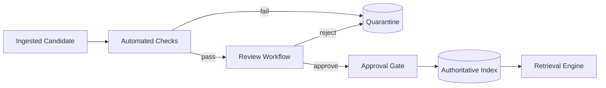

# Volume 14 - Knowledge Validation

| Field | Value |
|---|---|
| Document ID | WORLD-VOL14-021 |
| Title | Knowledge Validation |
| Version | 1.0 |
| Status | Approved |
| Classification | Internal |
| Founder | Mahesh Choudhary |

## Purpose

This chapter specifies how Project WORLD verifies that knowledge is trustworthy before it becomes retrievable to the AI and the enterprise. Unvalidated knowledge is a liability: an unverified source, an unreviewed policy, or an unattributed claim can propagate error at machine speed. This chapter defines the validation controls - source verification, review workflows, and approval gates - that ensure only verified, attributed, and approved knowledge enters the authoritative index.

## Scope

This chapter covers source verification, structural and semantic checks, human review workflows, approval gating, and validation state as it governs retrieval eligibility. It applies to every knowledge unit across the sources of Section B and works in concert with versioning (Chapter 20) and quality measurement (Chapter 25). It aligns with the data validation and stewardship model of Volume 09 (Chapters 27-29). It does not perform the underlying editorial authoring; it governs the gate through which authored knowledge must pass.

## Architecture

Validation is a staged pipeline between ingestion and the authoritative index. A candidate version first passes automated checks - source authenticity, completeness, format, and attribution. It then enters a review workflow routed to the accountable steward or subject-matter expert defined in governance. Only on approval does the version acquire retrieval eligibility; rejected or pending versions remain quarantined and invisible to retrieval.

This staged gate ensures that retrieval eligibility is earned through verification and human accountability, never granted by default.

## Data Flow

A candidate version enters validation, is checked automatically, and is routed for review. Reviewers verify the source, confirm attribution, and approve or reject. Approved versions become retrievable; rejected ones return to the author with reasons. Validation state travels with the version and is auditable.

| Validation Stage | Control | Outcome |
|---|---|---|
| Source verification | Confirms authentic, authorised origin | Trusted provenance |
| Structural check | Completeness and format | Well-formed unit |
| Attribution check | Author and citation present | Traceable claim |
| Human review | Steward or expert judgement | Approve or reject |
| Approval gate | Grants retrieval eligibility | Authoritative status |

## Relationship with AI

The AI Partner retrieves only validated knowledge, so its answers rest on verified, attributed sources. Validation state is a hard filter in retrieval: pending or rejected content cannot surface, which prevents the AI from citing unverified claims. When the AI answers, the underlying units are, by construction, source-verified and approved, reinforcing trust in automated reasoning.

## Relationship with ERP

Where knowledge governs ERP behaviour - a rule, a policy, an SOP - validation ensures the ERP acts only on approved logic. A business rule indexed from Volume 05 becomes retrievable for explanation only after its knowledge representation is validated, keeping the explanation layer consistent with the executable, governed source of record.

## Relationship with Analytics

Analytics (Volume 04) measures validation throughput, rejection rates, and review latency, exposing bottlenecks and error-prone sources. These signals feed the accuracy and coverage dimensions of Chapter 25 and help stewards target sources that repeatedly fail verification.

## Implementation Strategy

WORLD implements validation as a mandatory gate with automated checks first and human review for material knowledge. Review routing derives from the ownership model of governance (Chapter 22), so every unit has an accountable reviewer. High-risk classes - compliance, financial, safety - require dual review. Validation state is immutable per version and audit-logged, and rejected content is retained with reasons to support continuous improvement.

**Enterprise example:** A new supplier-onboarding policy is submitted to the Knowledge Engine. Automated checks confirm it originates from the authorised policy repository and carries an author and effective date. The compliance steward reviews it, verifies alignment with regulation, and approves it. Only then does it become retrievable, so when an agent later cites onboarding requirements, it quotes a source-verified, human-approved policy rather than a draft.

## Key Components

| Component | Responsibility |
|---|---|
| Source Verifier | Confirms authentic, authorised origin |
| Automated Checker | Validates structure, format, attribution |
| Review Router | Assigns candidates to accountable reviewers |
| Approval Gate | Grants or withholds retrieval eligibility |
| Quarantine Store | Isolates pending and rejected content |
| Validation Auditor | Logs validation state and decisions |

## Cross-References

- [Knowledge Versioning](/docs/blueprint/volume-14-knowledge-engine/section-e-quality-and-governance/20-knowledge-versioning.md)
- [Knowledge Governance](/docs/blueprint/volume-14-knowledge-engine/section-e-quality-and-governance/22-knowledge-governance.md)
- [Knowledge Quality](/docs/blueprint/volume-14-knowledge-engine/section-e-quality-and-governance/25-knowledge-quality.md)
- [Volume 09 - Data Platform](/docs/blueprint/volume-09-data-platform/README.md)

## References

- [Volume 01 - Vision and Philosophy](/docs/blueprint/volume-01-vision-and-philosophy/README.md)
- [Document Standards](/docs/governance/document-standards.md)

## Change Log

| Version | Date | Author | Notes |
|---|---|---|---|
| 1.0 | 2026-07-12 | Lead Software Engineer | Initial approved version. |
