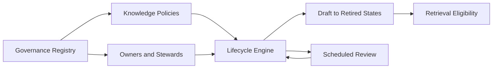

# Volume 14 - Knowledge Governance

| Field | Value |
|---|---|
| Document ID | WORLD-VOL14-022 |
| Title | Knowledge Governance |
| Version | 1.0 |
| Status | Approved |
| Classification | Internal |
| Founder | Mahesh Choudhary |

## Purpose

This chapter specifies how Project WORLD governs knowledge as a managed enterprise asset. Governance establishes who owns knowledge, who is accountable for its accuracy, what lifecycle it follows, and which policies constrain its creation, retention, and retirement. Without governance, knowledge accumulates without ownership, decays without review, and drifts from the authoritative sources it should mirror. This chapter defines the ownership, stewardship, lifecycle, and policy framework that keeps the Knowledge Engine accountable and auditable.

## Scope

This chapter covers knowledge ownership and stewardship roles, the knowledge lifecycle from creation to retirement, review cadences, retention policy, and the accountability model that binds them. It applies to all knowledge units and orchestrates the controls defined in versioning (Chapter 20), validation (Chapter 21), security (Chapter 23), and quality (Chapter 25). It aligns with the enterprise governance model of Volume 02 and the data governance framework of Volume 09 (Chapters 27-29). It defines governance of knowledge, not the governance of the ERP itself.

## Architecture

Governance assigns every knowledge domain an accountable owner and one or more stewards. A governance registry records ownership, classification, retention rules, and review cadence for each domain. A lifecycle engine drives units through defined states - draft, validated, published, under review, and retired - enforcing review at cadence and retirement at end of life. A policy layer expresses the rules that govern these transitions.

This structure makes accountability explicit: every unit has a named owner, a lifecycle state, and a policy that governs its transitions.

## Data Flow

When a domain is registered, governance records its owner, steward, classification, and retention. Units created within it inherit these attributes and enter the lifecycle. The lifecycle engine schedules reviews, escalates overdue items to owners, and retires units at end of life. Governance decisions are logged for audit.

| Governance Element | Description | Effect |
|---|---|---|
| Owner | Accountable authority for a domain | Final decision rights |
| Steward | Day-to-day maintainer | Review and curation |
| Classification | Sensitivity label | Drives security controls |
| Retention rule | Lifespan and disposal policy | Timed retirement |
| Review cadence | Mandatory re-verification interval | Prevents decay |

## Relationship with AI

Governance defines the trust boundary the AI operates within. The AI retrieves only published, in-cadence knowledge; units overdue for review are flagged or de-prioritised so the AI does not rely on decayed content. Ownership metadata lets the AI attribute knowledge to an accountable authority, and lifecycle state ensures retired knowledge is no longer surfaced.

## Relationship with ERP

Governance mirrors the accountability the ERP enforces on transactions. Where ERP knowledge sources such as policies and business rules originate in Volume 05, governance assigns knowledge-side ownership and review, ensuring the indexed representation is maintained in step with the authoritative operational source and retired when the source is retired.

## Relationship with Analytics

Analytics (Volume 04) reports governance health: ownership coverage, overdue reviews, retention compliance, and lifecycle distribution. These metrics reveal ungoverned or decaying knowledge and feed the freshness and coverage dimensions of Chapter 25, giving owners an objective view of their domains.

## Implementation Strategy

WORLD implements governance registry-first: no knowledge domain is published without an assigned owner, classification, and retention rule. The lifecycle engine enforces review cadence and escalates overdue items. Retention policies align with legal and regulatory schedules, and retirement preserves history through versioning rather than deletion. Governance roles derive from the enterprise model of Volume 02 to avoid a parallel hierarchy.

**Enterprise example:** The finance domain owns a set of revenue-recognition SOPs with a twelve-month review cadence. As the cadence lapses, the lifecycle engine flags the SOPs and notifies the finance steward and owner. Until re-verified, the AI de-prioritises them and marks answers as pending review. The steward updates and re-validates the SOPs, the owner approves, and they return to full retrieval - decay prevented by governed cadence rather than chance.

## Key Components

| Component | Responsibility |
|---|---|
| Governance Registry | Records ownership, classification, retention |
| Ownership Model | Assigns owners and stewards to domains |
| Lifecycle Engine | Drives units through defined states |
| Review Scheduler | Enforces cadence and escalates overdue items |
| Retention Manager | Applies disposal and retirement policy |
| Governance Auditor | Logs decisions and lifecycle transitions |

## Cross-References

- [Knowledge Validation](/docs/blueprint/volume-14-knowledge-engine/section-e-quality-and-governance/21-knowledge-validation.md)
- [Knowledge Security](/docs/blueprint/volume-14-knowledge-engine/section-e-quality-and-governance/23-knowledge-security.md)
- [Knowledge Quality](/docs/blueprint/volume-14-knowledge-engine/section-e-quality-and-governance/25-knowledge-quality.md)
- [Volume 09 - Data Platform](/docs/blueprint/volume-09-data-platform/README.md)

## References

- [Volume 01 - Vision and Philosophy](/docs/blueprint/volume-01-vision-and-philosophy/README.md)
- [Document Standards](/docs/governance/document-standards.md)

## Change Log

| Version | Date | Author | Notes |
|---|---|---|---|
| 1.0 | 2026-07-12 | Lead Software Engineer | Initial approved version. |
