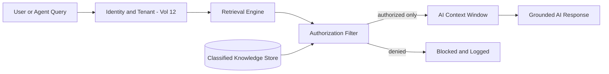

# Volume 14 - Knowledge Security

| Field | Value |
|---|---|
| Document ID | WORLD-VOL14-023 |
| Title | Knowledge Security |
| Version | 1.0 |
| Status | Approved |
| Classification | Internal |
| Founder | Mahesh Choudhary |

## Purpose

This chapter specifies how Project WORLD secures knowledge so that access, classification, and tenant boundaries are enforced consistently - especially at the moment knowledge is retrieved into AI responses. Knowledge concentrates an enterprise's most sensitive content: strategy, financials, personal data, and regulated records. If retrieval ignored security, the AI could leak restricted knowledge to unauthorised users. This chapter defines the access control, classification, tenant isolation, and leakage-prevention controls that keep knowledge secure throughout its lifecycle.

## Scope

This chapter covers access control, knowledge classification, tenant isolation, retrieval-time authorisation, and prevention of knowledge leakage into AI responses. It applies to every knowledge unit and every retrieval path. It aligns directly with the security architecture of Volume 12 - identity, access control, classification, and multi-tenant isolation - which it inherits rather than redefines. This chapter applies those controls to the specific risk surface of a retrieval-augmented knowledge system.

## Architecture

Security is enforced at both storage and retrieval. Every knowledge unit carries a classification label and an access policy inherited from Volume 12. Storage is partitioned per tenant so no query can cross tenant boundaries. At retrieval, an authorisation filter evaluates the requesting principal's identity, roles, and tenant against each candidate unit's policy before any content reaches the AI. Only authorised units enter the context window, and the response layer is constrained to cite only what was authorised.

By filtering before content enters the context window, the design prevents restricted knowledge from ever reaching the model on behalf of an unauthorised principal.

## Data Flow

A query arrives with an authenticated identity and tenant from Volume 12. Retrieval gathers candidates, then the authorisation filter removes any unit the principal may not access. Authorised units enter the AI context; denied access is logged. The response cites only authorised sources, and classification labels travel with every citation.

| Security Control | Enforcement Point | Purpose |
|---|---|---|
| Identity and roles | Query entry | Establishes principal |
| Classification label | Every unit | Sensitivity-based control |
| Tenant partition | Storage and retrieval | Prevents cross-tenant access |
| Authorization filter | Before context window | Blocks unauthorised content |
| Leakage guard | Response assembly | Stops restricted disclosure |

## Relationship with AI

The AI receives only knowledge the requesting principal is authorised to see, so it cannot leak restricted content even when asked directly. Because authorisation is applied before the context window is assembled, the model never holds unauthorised knowledge in memory for that turn. Citations carry classification, so users understand the sensitivity of what they are shown, and denied content is invisible rather than redacted-in-place.

## Relationship with ERP

Knowledge security mirrors ERP access control. A user who cannot view a payroll record in the ERP must not retrieve payroll knowledge through the AI. By inheriting the Volume 12 identity and role model that the ERP also uses, retrieval-time authorisation stays consistent with ERP permissions, closing the gap where knowledge could otherwise become a side channel around operational controls.

## Relationship with Analytics

Analytics (Volume 04) consumes security telemetry - access grants, denials, and classification distribution - to detect anomalous access, over-broad permissions, and potential leakage attempts. These signals support security review under Volume 12 and inform the governance controls of Chapter 22 without exposing the restricted content itself.

## Implementation Strategy

WORLD implements security as retrieval-time authorisation layered on Volume 12. Classification is mandatory at ingestion; unclassified content is treated as restricted by default. Tenant isolation is enforced at the storage layer so cross-tenant retrieval is structurally impossible. The leakage guard validates that every cited unit was authorised for the principal, and all access decisions are audit-logged. Highly sensitive classes require step-up authorisation.

**Enterprise example:** A regional sales manager asks the AI for the margin strategy on a key account. Retrieval finds the strategy document, but it is classified restricted to the executive tenant scope. The authorisation filter removes it before it reaches the model, the AI answers only from content the manager may access, and the denied access is logged. The confidential strategy never enters the response, preventing leakage while preserving a full audit trail.

## Key Components

| Component | Responsibility |
|---|---|
| Classification Engine | Labels every unit by sensitivity |
| Authorization Filter | Enforces access before the context window |
| Tenant Isolator | Partitions storage and retrieval per tenant |
| Leakage Guard | Verifies citations against authorisation |
| Identity Adapter | Inherits Volume 12 identity and roles |
| Security Auditor | Logs access grants and denials |

## Cross-References

- [Knowledge Governance](/docs/blueprint/volume-14-knowledge-engine/section-e-quality-and-governance/22-knowledge-governance.md)
- [Knowledge Quality](/docs/blueprint/volume-14-knowledge-engine/section-e-quality-and-governance/25-knowledge-quality.md)
- [Volume 12 - Security and Trust](/docs/blueprint/volume-12-security-and-trust/README.md)
- [Volume 09 - Data Platform](/docs/blueprint/volume-09-data-platform/README.md)

## References

- [Volume 01 - Vision and Philosophy](/docs/blueprint/volume-01-vision-and-philosophy/README.md)
- [Document Standards](/docs/governance/document-standards.md)

## Change Log

| Version | Date | Author | Notes |
|---|---|---|---|
| 1.0 | 2026-07-12 | Lead Software Engineer | Initial approved version. |
