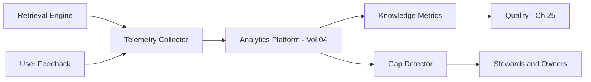

# Volume 14 - Knowledge Analytics

| Field | Value |
|---|---|
| Document ID | WORLD-VOL14-024 |
| Title | Knowledge Analytics |
| Version | 1.0 |
| Status | Approved |
| Classification | Internal |
| Founder | Mahesh Choudhary |

## Purpose

This chapter specifies how Project WORLD measures the behaviour and health of the Knowledge Engine. Knowledge that cannot be measured cannot be improved: without analytics, the enterprise cannot know what is retrieved, what is missing, what decays, or where the AI relies on weak sources. This chapter defines the metrics, telemetry, and feedback loops that turn knowledge usage into evidence, enabling continuous improvement of coverage, freshness, and trust.

## Scope

This chapter covers retrieval telemetry, usage and coverage metrics, gap detection, source-effectiveness measurement, and the feedback loop into quality and governance. It applies to all knowledge sources and retrieval paths. It aligns with the analytics platform of Volume 04, which provides the measurement and reporting infrastructure this chapter draws on, and it feeds the quality dimensions of Chapter 25. It measures knowledge; it does not author or govern it.

## Architecture

Analytics instruments the retrieval pipeline to capture every query, the units retrieved, their relevance, and whether the answer satisfied the need. Telemetry flows to the Volume 04 analytics platform, where it is aggregated into knowledge metrics: usage, coverage, freshness, and source effectiveness. A gap detector identifies unanswered or poorly answered queries, and a feedback service routes findings to stewards and to the quality controls of Chapter 25.

This closed loop converts everyday retrieval into measured signal that drives targeted improvement rather than guesswork.

## Data Flow

Each retrieval emits telemetry: query, candidates, ranking, selected sources, and outcome. User feedback augments outcome signals. The analytics platform aggregates these into metrics and detects gaps. Findings route to stewards for action and to quality measurement for scoring. Metrics are dashboarded for owners.

| Metric | Definition | Improvement Signal |
|---|---|---|
| Retrieval usage | How often a unit is retrieved | Value and redundancy |
| Coverage | Share of queries answered | Missing knowledge |
| Freshness | Age against review cadence | Decay risk |
| Source effectiveness | Answer success per source | Weak sources |
| Gap rate | Unanswered or low-confidence queries | Priorities for authoring |

## Relationship with AI

Analytics observes how the AI actually uses knowledge, revealing which sources ground successful answers and which lead to low-confidence or unanswered responses. This lets teams strengthen the knowledge the AI depends on. The AI also contributes signal: confidence scores and unresolved queries feed the gap detector, so the AI's own experience drives improvement of the knowledge it relies on.

## Relationship with ERP

Analytics links knowledge usage to ERP outcomes. When a business rule or SOP indexed from Volume 05 is retrieved to support a decision, analytics can correlate the knowledge used with the operational result, measuring which knowledge genuinely improves decision quality and where operational friction signals a knowledge gap.

## Relationship with Analytics

This chapter is the Knowledge Engine's use of the enterprise analytics platform (Volume 04). It does not build a parallel analytics stack; it defines the knowledge-specific metrics, telemetry, and dashboards that run on Volume 04 infrastructure, reusing its aggregation, storage, and reporting so knowledge health sits alongside other enterprise metrics.

## Implementation Strategy

WORLD implements analytics by instrumenting retrieval end to end and streaming telemetry to Volume 04. Metrics are defined against the quality dimensions of Chapter 25 so measurement and scoring stay aligned. Gap detection is prioritised by business impact, and dashboards give owners visibility into their domains. Feedback loops are closed by routing gaps to accountable stewards under the governance model of Chapter 22.

**Enterprise example:** Analytics shows a rising gap rate for return-policy queries in a new market: many go unanswered or low-confidence. The gap detector flags the theme and routes it to the customer-service steward. Telemetry reveals the market's return rules were never indexed. The steward onboards them, and within weeks coverage for the theme rises and the gap rate falls - an improvement driven by measured evidence rather than anecdote.

## Key Components

| Component | Responsibility |
|---|---|
| Telemetry Collector | Captures retrieval and feedback signals |
| Metrics Aggregator | Computes usage, coverage, freshness |
| Gap Detector | Identifies unanswered or weak queries |
| Source Effectiveness Scorer | Rates sources by answer success |
| Feedback Router | Routes findings to stewards and quality |
| Knowledge Dashboards | Presents domain health to owners |

## Cross-References

- [Knowledge Governance](/docs/blueprint/volume-14-knowledge-engine/section-e-quality-and-governance/22-knowledge-governance.md)
- [Knowledge Quality](/docs/blueprint/volume-14-knowledge-engine/section-e-quality-and-governance/25-knowledge-quality.md)
- [Volume 04 - Analytics and Intelligence](/docs/blueprint/volume-04-analytics-and-intelligence/README.md)
- [Knowledge Validation](/docs/blueprint/volume-14-knowledge-engine/section-e-quality-and-governance/21-knowledge-validation.md)

## References

- [Volume 01 - Vision and Philosophy](/docs/blueprint/volume-01-vision-and-philosophy/README.md)
- [Document Standards](/docs/governance/document-standards.md)

## Change Log

| Version | Date | Author | Notes |
|---|---|---|---|
| 1.0 | 2026-07-12 | Lead Software Engineer | Initial approved version. |
