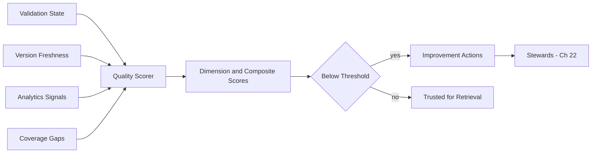

# Volume 14 - Knowledge Quality

| Field | Value |
|---|---|
| Document ID | WORLD-VOL14-025 |
| Title | Knowledge Quality |
| Version | 1.0 |
| Status | Approved |
| Classification | Internal |
| Founder | Mahesh Choudhary |

## Purpose

This chapter specifies how Project WORLD defines, measures, and improves the quality of knowledge as a first-class enterprise metric. Quality is the property that makes knowledge worth trusting: an answer is only as good as the accuracy, freshness, relevance, and coverage of the knowledge behind it. This chapter defines the quality dimensions, scoring model, and improvement loop that hold the Knowledge Engine to a measurable standard and turn the controls of this section into an accountable outcome.

## Scope

This chapter covers the knowledge quality dimensions - accuracy, freshness, relevance, and coverage - their measurement, scoring, thresholds, and the continuous-improvement loop that acts on them. It applies to every knowledge unit and domain. It synthesises the outputs of versioning (Chapter 20), validation (Chapter 21), governance (Chapter 22), and analytics (Chapter 24), and aligns with the data quality framework of Volume 09 (Chapters 27-29). It defines how quality is judged and improved, not the underlying controls, which the earlier chapters own.

## Architecture

A quality service scores each knowledge unit and domain against four dimensions. Accuracy is assessed from validation state and source verification; freshness from age against review cadence; relevance from retrieval effectiveness; and coverage from gap analysis. Dimension scores combine into a unit and domain quality score measured against thresholds. Units below threshold trigger improvement actions routed to stewards, closing the loop.

This makes quality an explicit, thresholded outcome rather than an assumed property, and ties every low score to an accountable owner.

## Data Flow

The quality scorer ingests signals from validation, versioning, and analytics, computes dimension scores, and combines them into composite scores. Scores are compared to thresholds; failures raise improvement actions routed to stewards. Scores are published to dashboards and attached to retrieval so answers can carry a confidence signal.

| Dimension | Measures | Primary Signal Source |
|---|---|---|
| Accuracy | Correctness and verification | Validation (Ch 21) |
| Freshness | Currency against cadence | Versioning (Ch 20) |
| Relevance | Usefulness to real queries | Analytics (Ch 24) |
| Coverage | Completeness of the domain | Gap detection (Ch 24) |

## Relationship with AI

Quality scores let the AI reason about how much to trust each source. High-quality units are preferred and cited with confidence; low-quality units are de-prioritised or flagged, so the AI does not present stale or weakly covered knowledge as authoritative. Quality signals attached to answers help users calibrate their reliance on AI responses.

## Relationship with ERP

Knowledge quality directly affects ERP decision integrity. When a policy or business rule from Volume 05 is retrieved to explain or support a decision, its quality score indicates whether the enterprise should rely on it. Low-quality knowledge governing operational decisions is escalated for remediation, protecting the ERP from acting on stale or unverified logic.

## Relationship with Analytics

Quality is measured through the analytics platform of Volume 04 and Chapter 24. Analytics supplies the relevance and coverage signals, while quality synthesises them with accuracy and freshness into scores. Quality thresholds, in turn, become metrics that analytics tracks over time, showing whether the Knowledge Engine is improving.

## Implementation Strategy

WORLD implements quality as a continuous scoring loop, not a periodic audit. Dimension scores are recomputed as underlying signals change, thresholds are set per domain by risk, and failing units automatically raise improvement actions to accountable stewards under Chapter 22. Quality scores are exposed on dashboards and attached to retrieval. Critical domains - compliance, finance, safety - carry the strictest thresholds and fastest remediation.

**Enterprise example:** A product-specification domain scores well on accuracy and relevance but its freshness falls as specifications age past the review cadence, dropping the composite below threshold. The quality service raises an improvement action to the product steward, and the AI begins flagging affected answers as potentially outdated. The steward refreshes and re-validates the specifications, freshness recovers, the composite rises above threshold, and confident retrieval resumes - a measurable quality recovery driven by the improvement loop.

## Key Components

| Component | Responsibility |
|---|---|
| Quality Scorer | Computes dimension and composite scores |
| Accuracy Assessor | Derives accuracy from validation and source |
| Freshness Monitor | Scores currency against review cadence |
| Relevance Evaluator | Scores usefulness from retrieval signals |
| Coverage Analyzer | Scores completeness from gap detection |
| Improvement Router | Raises actions for below-threshold units |

## Cross-References

- [Knowledge Versioning](/docs/blueprint/volume-14-knowledge-engine/section-e-quality-and-governance/20-knowledge-versioning.md)
- [Knowledge Validation](/docs/blueprint/volume-14-knowledge-engine/section-e-quality-and-governance/21-knowledge-validation.md)
- [Knowledge Analytics](/docs/blueprint/volume-14-knowledge-engine/section-e-quality-and-governance/24-knowledge-analytics.md)
- [Volume 09 - Data Platform](/docs/blueprint/volume-09-data-platform/README.md)

## References

- [Volume 01 - Vision and Philosophy](/docs/blueprint/volume-01-vision-and-philosophy/README.md)
- [Document Standards](/docs/governance/document-standards.md)

## Change Log

| Version | Date | Author | Notes |
|---|---|---|---|
| 1.0 | 2026-07-12 | Lead Software Engineer | Initial approved version. |
