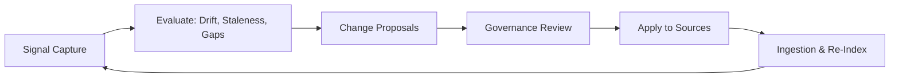

# Volume 14 - Knowledge Evolution

| Field | Value |
|---|---|
| Document ID | WORLD-VOL14-026 |
| Title | Knowledge Evolution |
| Version | 1.0 |
| Status | Approved |
| Classification | Internal |
| Founder | Mahesh Choudhary |

## Purpose

This chapter defines how the Knowledge Engine of Project WORLD improves itself over time. Knowledge is not a static asset that is captured once and consumed forever; it decays, contradicts itself, and is superseded as the business changes. Knowledge Evolution is the governed set of mechanisms by which the corpus is continuously refined - stale units are retired, contradictions are resolved, gaps are surfaced, and retrieval quality is fed back into the sources that produced it. Where Knowledge Versioning (Chapter 20) records what changed, this chapter governs why and how the corpus should change so that the AI Business Partner (Volume 03) and AI Agents (Volume 13) are always grounded in current, coherent truth.

## Scope

This chapter covers the evolution loop: signal capture, drift and staleness detection, gap analysis, contradiction resolution, and the governed feedback that updates sources. It builds on Knowledge Analytics (Chapter 24) and Knowledge Quality (Chapter 25) as its measurement substrate, and consumes Knowledge Governance (Chapter 22) as its authorization boundary. It does not redefine the versioning mechanics, the validation rules, or the retrieval internals; it orchestrates them into a continuous improvement cycle. Fully autonomous curation is introduced in the Future Knowledge Vision (Chapter 28); this chapter specifies the governed, human-accountable form.

## Architecture

Knowledge Evolution is a closed loop layered over the corpus. Usage and quality signals are captured from retrieval, feed an evaluation stage that detects drift, staleness, gaps, and contradictions, and produce change proposals. Proposals are reviewed under governance and applied back to the sources, which re-enter the ingestion pipeline. Every cycle is measured, so the loop itself is observable.

The loop is deliberately governed rather than automatic: a proposal to retire a policy or resolve a contradiction is a consequential change and must pass the approval boundary of Chapter 22 before it is applied. This keeps evolution accountable while allowing the detection and proposal stages to run continuously.

## Data Flow

Retrieval events emit usage, citation, and feedback signals. The evaluation stage aggregates these with quality scores to flag units that are stale, unused, contradicted, or missing. Each flag becomes a change proposal routed to the owning source's steward. Approved proposals mutate the source, which triggers re-ingestion, re-embedding, and re-indexing; the new state then generates fresh signals, closing the loop.

| Stage | Action | Output |
|---|---|---|
| Capture | Collect usage, citation, and feedback signals | Evolution signal set |
| Evaluate | Detect drift, staleness, gaps, contradictions | Prioritized findings |
| Propose | Convert findings into change proposals | Reviewable proposals |
| Govern | Steward approves, rejects, or defers | Authorized change |
| Apply | Update source and re-index | Refreshed corpus |

## Relationship with AI

Evolution is what keeps AI grounding trustworthy over time. The AI Business Partner and AI Agents are the primary generators of evolution signals: their retrievals reveal which knowledge is used, which is ignored, and where answers fail for lack of a source. Conversely, the agents are the first beneficiaries of an evolved corpus, since retiring a stale unit or resolving a contradiction directly reduces hallucination and improves faithfulness. The Learning tier of Volume 13 and this loop are complementary - agents improve their behaviour, and evolution improves the knowledge they stand on.

## Relationship with ERP

The ERP (Volumes 05 and 06) is a strong evolution signal because its transactions reveal how work is actually done versus how policies and SOPs say it should be done. A rising rate of exceptions against a business rule is a gap signal; a process that consistently deviates from its SOP is a staleness signal. Evolution feeds corrected policies, SOPs, and rules back into the ERP-governing source set, so the documented truth and the executed reality converge.

## Relationship with Analytics

Analytics (Volume 04) is the measurement engine of evolution. Knowledge Analytics (Chapter 24) supplies the usage and coverage metrics, and Knowledge Quality (Chapter 25) supplies the freshness and accuracy scores that the evaluation stage consumes. In return, evolution produces its own analytics - proposal volume, resolution time, and post-change quality lift - that let leadership see the corpus improving as a managed trend rather than trusting it on faith.

## Implementation Strategy

WORLD implements evolution signal-first, then closes the loop stage by stage. Signal capture is instrumented at retrieval from day one; detection begins with the cheapest, highest-value checks - staleness by age and unused-unit reports - before adding contradiction and gap analysis. Proposals are human-reviewed throughout the initial phase; automation is added only for low-risk, reversible changes and always behind the governance boundary. Every applied change is versioned and reversible, so evolution can never silently degrade the corpus.

**Enterprise example:** A logistics firm sees the AI Partner repeatedly cite a two-year-old customs SOP while ERP data shows brokers now follow a revised process. The evaluation stage flags the SOP as stale (age plus deviation signals) and raises a change proposal. The trade-compliance steward reviews it, approves a revision, and the updated SOP is re-ingested. Within a cycle, the AI Partner cites the current SOP, contradiction flags clear, and the quality dashboard records a freshness lift for the customs knowledge domain.

## Key Components

| Component | Responsibility |
|---|---|
| Signal Collector | Captures usage, citation, and feedback from retrieval |
| Evaluation Engine | Detects drift, staleness, gaps, and contradictions |
| Proposal Manager | Turns findings into reviewable change proposals |
| Governance Gate | Enforces steward approval before any change applies |
| Re-Ingestion Trigger | Re-indexes updated sources into the corpus |
| Evolution Metrics | Reports proposal volume, resolution time, and quality lift |

## Cross-References

- [Knowledge Analytics](/docs/blueprint/volume-14-knowledge-engine/section-e-quality-and-governance/24-knowledge-analytics.md)
- [Knowledge Quality](/docs/blueprint/volume-14-knowledge-engine/section-e-quality-and-governance/25-knowledge-quality.md)
- [Enterprise Knowledge Platform](/docs/blueprint/volume-14-knowledge-engine/section-f-platform-and-evolution/27-enterprise-knowledge-platform.md)
- [Volume 03 - AI Business Partner](/docs/blueprint/volume-03-ai-business-partner/README.md)

## References

- [Volume 01 - Vision and Philosophy](/docs/blueprint/volume-01-vision-and-philosophy/README.md)
- [Document Standards](/docs/governance/document-standards.md)

## Change Log

| Version | Date | Author | Notes |
|---|---|---|---|
| 1.0 | 2026-07-12 | Lead Software Engineer | Initial approved version. |
