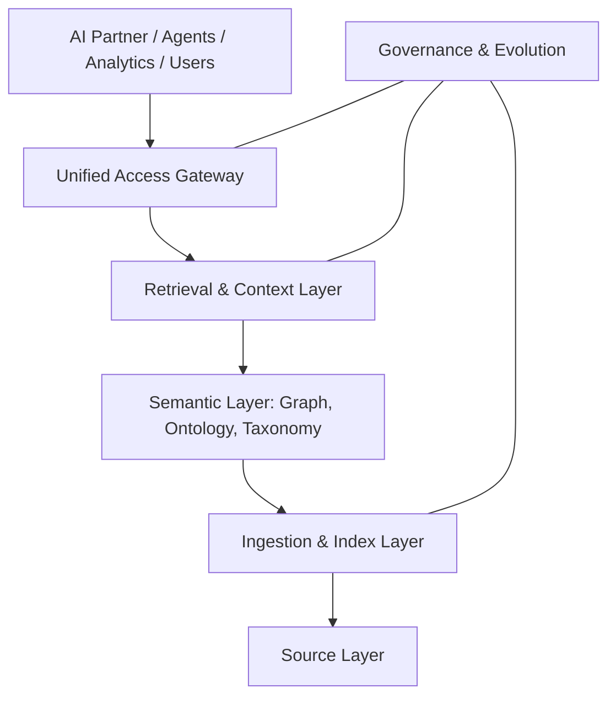

# Volume 14 - Enterprise Knowledge Platform

| Field | Value |
|---|---|
| Document ID | WORLD-VOL14-027 |
| Title | Enterprise Knowledge Platform |
| Version | 1.0 |
| Status | Approved |
| Classification | Internal |
| Founder | Mahesh Choudhary |

## Purpose

This chapter defines the Enterprise Knowledge Platform: the unified surface that brings every capability of the Knowledge Engine - sources, ingestion, retrieval, structure, governance, and evolution - together into one coherent, governed product. Individual chapters specify individual capabilities; this chapter specifies how they compose into a single platform that any consumer in Project WORLD can rely on through one contract. The purpose is consolidation: instead of a scatter of point solutions, WORLD exposes one knowledge platform with one access model, one provenance guarantee, and one quality standard, so that grounding is uniform wherever knowledge is used.

## Scope

This chapter covers the platform's layered architecture, its unified access contract, the shared services every capability exposes, and the operating model that runs it. It integrates the source layer of Section B, the retrieval layer of Section C, the semantic layer of Section D, the governance layer of Section E, and the evolution loop of Chapter 26 into one whole. It does not re-specify those layers; it defines the seams that join them and the single interface presented outward to the AI Partner, the AI Agents, Analytics, and human users.

## Architecture

The platform is a layered stack with a single access gateway. Sources feed a common ingestion and indexing layer; a semantic layer adds structure; a retrieval layer serves grounded, cited results; and a governance-and-evolution layer wraps the whole. Every consumer enters through one gateway that enforces identity, access scope, and provenance.

The gateway is the single point of accountability: it authenticates the principal, applies access scope, resolves the query across sources, and returns cited results. Governance and evolution are cross-cutting concerns wired into every layer rather than a separate silo.

## Data Flow

A consumer issues a request to the gateway with its identity and intent. The gateway authorizes the request, the retrieval layer resolves it across indexes using the semantic layer for expansion and disambiguation, and access filters restrict results to the principal's scope. Results return with citations and confidence, and the request itself becomes a governance and evolution signal.

| Stage | Action | Output |
|---|---|---|
| Request | Consumer submits query with identity and intent | Authenticated request |
| Authorize | Gateway applies access scope and policy | Scoped request |
| Resolve | Retrieval and semantic layers rank units | Candidate results |
| Return | Cited, confidence-scored results delivered | Grounded response |
| Observe | Request logged for governance and evolution | Platform signal |

## Relationship with AI

The platform is the single knowledge dependency of the AI tier. Rather than each agent integrating sources and indexes independently, every agent and the AI Business Partner consume knowledge through the one gateway, inheriting uniform grounding, citation, and access control. This consolidation is what makes AI behaviour consistent and auditable across the organization: two agents asking the same question against the same scope receive the same governed answer, because they share one platform rather than many.

## Relationship with ERP

The ERP (Volumes 05 and 06) is both a first-class source contributor and a first-class consumer of the platform. Its document, policy, SOP, and rule stores feed the source layer, while ERP-embedded assistance queries the platform for the policy or procedure governing a transaction in flight. Because both directions pass through the same gateway, the ERP benefits from identical provenance and access guarantees as every other consumer.

## Relationship with Analytics

Analytics (Volume 04) consumes the platform to contextualize quantitative findings and contributes platform telemetry back as an analytics domain. Dashboards explain anomalies against retrieved knowledge, and the platform's own operational metrics - query volume, latency, cited-answer rate, and coverage - are surfaced as analytics so the knowledge platform can be managed with the same rigor as any other enterprise system.

## Implementation Strategy

WORLD builds the platform gateway-first so that consumers integrate once against a stable contract while the layers behind it mature. The unified access contract and provenance guarantee are fixed early; individual capability layers are wired in behind it without changing the outward interface. Governance and evolution are treated as platform-native from the start, not bolted on. The platform is delivered as a managed internal service with defined availability, latency, and quality targets, so consumers can depend on knowledge as reliably as they depend on the database.

**Enterprise example:** A financial-services group runs the AI Partner, a compliance agent, a customer-service agent, and an analytics workbench. All four query the single knowledge platform through one gateway. When regulators tighten a disclosure rule, the change enters once at the source layer, propagates through ingestion and the semantic layer, and every consumer immediately retrieves the updated, cited rule under its own access scope - no consumer re-integrates, and provenance is identical everywhere.

## Key Components

| Component | Responsibility |
|---|---|
| Unified Access Gateway | Single authenticated, scoped entry point for all consumers |
| Retrieval & Context Layer | Resolves queries into ranked, cited results |
| Semantic Layer | Applies graph, ontology, and taxonomy to queries and units |
| Ingestion & Index Layer | Normalizes, embeds, and indexes source units |
| Source Layer | Registers and connects all knowledge origins |
| Governance & Evolution Fabric | Enforces policy and drives continuous improvement across layers |

## Cross-References

- [Knowledge Evolution](/docs/blueprint/volume-14-knowledge-engine/section-f-platform-and-evolution/26-knowledge-evolution.md)
- [Future Knowledge Vision](/docs/blueprint/volume-14-knowledge-engine/section-f-platform-and-evolution/28-future-knowledge-vision.md)
- [Retrieval Engine](/docs/blueprint/volume-14-knowledge-engine/section-c-retrieval-and-context/12-retrieval-engine.md)
- [Volume 04 - Business Intelligence & Decision Science](/docs/blueprint/volume-04-business-intelligence-and-decision-science/README.md)

## References

- [Volume 01 - Vision and Philosophy](/docs/blueprint/volume-01-vision-and-philosophy/README.md)
- [Document Standards](/docs/governance/document-standards.md)

## Change Log

| Version | Date | Author | Notes |
|---|---|---|---|
| 1.0 | 2026-07-12 | Lead Software Engineer | Initial approved version. |
