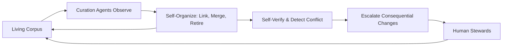

# Volume 14 - Future Knowledge Vision

| Field | Value |
|---|---|
| Document ID | WORLD-VOL14-028 |
| Title | Future Knowledge Vision |
| Version | 1.0 |
| Status | Approved |
| Classification | Internal |
| Founder | Mahesh Choudhary |

## Purpose

This chapter sets the long-horizon vision for the Knowledge Engine of Project WORLD: a self-organizing corpus curated by governed agents, where knowledge structures itself, maintains its own coherence, and is proactively delivered to the point of decision. Where Knowledge Evolution (Chapter 26) specifies the governed, human-in-the-loop improvement loop of today, this chapter describes the direction that loop is heading - toward agentic knowledge curation in which curation agents perform more of the detection, structuring, and maintenance work under human oversight. The purpose is to give the platform a coherent north star so that every present-day decision is compatible with where the Knowledge Engine is going. No delivery dates are asserted; this is direction, not schedule.

## Scope

This chapter covers the vision's guiding principles, its target capabilities - self-organizing knowledge, agentic curation, proactive and anticipatory delivery, and continuous self-verification - and the enduring guardrails that constrain them. It builds on the evolution loop of Chapter 26 and the unified platform of Chapter 27 as its foundation. It does not specify implementations, timelines, or commitments; those remain governed by the standard chapters. It deliberately keeps human accountability and provenance as non-negotiable invariants even as autonomy increases.

## Architecture

The future architecture reframes evolution as a standing population of governed curation agents that observe the corpus, propose and enact structural change within their authority, and escalate consequential decisions to human stewards. The unified platform remains the substrate; the curation agents become native inhabitants of it.

Autonomy is graduated and bounded. Low-risk, reversible structuring - linking related units, suggesting taxonomy placement, flagging duplicates - may be enacted by agents directly, while retirements, contradictions, and policy changes always escalate to human stewards. The guardrails of the governance layer never dissolve; they scale with autonomy.

## Data Flow

Curation agents continuously observe the living corpus and its usage, identify structuring and maintenance opportunities, and act within their granted authority or escalate beyond it. Enacted and approved changes flow back into the corpus, which the agents observe again. The cycle is perpetual, self-verifying, and fully attributed to the acting agent or approving steward.

| Stage | Action | Output |
|---|---|---|
| Observe | Agents monitor corpus, usage, and quality | Curation opportunities |
| Organize | Link, merge, place, or flag units | Proposed structure changes |
| Verify | Cross-check for conflict and coherence | Validated or escalated change |
| Escalate | Route consequential changes to stewards | Human decision |
| Attribute | Record actor and rationale | Auditable curation trail |

## Relationship with AI

This vision deepens the partnership between the AI tier and the Knowledge Engine. The AI Business Partner (Volume 03) and AI Agents (Volume 13) move from consuming a corpus that humans maintain to collaborating with curation agents that maintain it, and anticipatory delivery means knowledge reaches an agent before it explicitly asks. The reasoning and reflection capabilities of the agent tier are the same capabilities curation agents apply to knowledge itself, keeping the two tiers architecturally consistent while human accountability remains the anchor.

## Relationship with ERP

As the vision matures, the boundary between the ERP (Volumes 05 and 06) and the Knowledge Engine becomes more fluid. Curation agents learn from ERP execution patterns to keep policies, SOPs, and rules aligned with reality without waiting for a manual review cycle, proposing updates the moment documented and executed practice diverge. The ERP remains the system of record for transactions; the Knowledge Engine becomes a self-maintaining system of understanding beside it.

## Relationship with Analytics

Analytics (Volume 04) becomes both the sensing layer and the assurance layer for autonomous curation. It supplies the signals curation agents act on and independently measures their effect, so that increased autonomy is always matched by increased visibility. Proactive delivery extends analytics too: insights and their supporting knowledge are pushed to decision-makers in context, rather than waiting to be queried.

## Implementation Strategy

WORLD approaches this vision incrementally and safely, never as a single leap. Autonomy is expanded one reversible, well-instrumented capability at a time, each gated behind demonstrated quality and the standing governance boundary. Human stewards retain final authority over consequential change indefinitely; provenance and attribution are strengthened, not relaxed, as agents do more. Every step must be compatible with the unified platform and the evolution loop already in place, so the future is reached by deepening the present architecture rather than replacing it.

**Enterprise example:** A global manufacturer grants curation agents authority to link and deduplicate engineering knowledge but not to retire it. An agent notices three near-identical torque-specification notes across plants, merges them into one canonical unit with cross-links, and flags a fourth that contradicts the others. The contradiction escalates to the lead engineer, who resolves it. Over time the corpus grows more coherent on its own, while every consequential judgment remains a human decision with a full audit trail.

## Key Components

| Component | Responsibility |
|---|---|
| Curation Agent | Observes the corpus and enacts bounded structuring |
| Self-Organization Engine | Links, merges, places, and retires units under authority |
| Self-Verification Layer | Detects conflict and confirms coherence continuously |
| Escalation Gateway | Routes consequential changes to human stewards |
| Anticipatory Delivery | Pushes relevant knowledge to the point of decision |
| Attribution Ledger | Records every curation action and its rationale |

## Cross-References

- [Knowledge Evolution](/docs/blueprint/volume-14-knowledge-engine/section-f-platform-and-evolution/26-knowledge-evolution.md)
- [Enterprise Knowledge Platform](/docs/blueprint/volume-14-knowledge-engine/section-f-platform-and-evolution/27-enterprise-knowledge-platform.md)
- [Knowledge Graph](/docs/blueprint/volume-14-knowledge-engine/section-a-knowledge-foundations/03-knowledge-graph.md)
- [Volume 03 - AI Business Partner](/docs/blueprint/volume-03-ai-business-partner/README.md)

## References

- [Volume 01 - Vision and Philosophy](/docs/blueprint/volume-01-vision-and-philosophy/README.md)
- [Document Standards](/docs/governance/document-standards.md)

## Change Log

| Version | Date | Author | Notes |
|---|---|---|---|
| 1.0 | 2026-07-12 | Lead Software Engineer | Initial approved version. |
